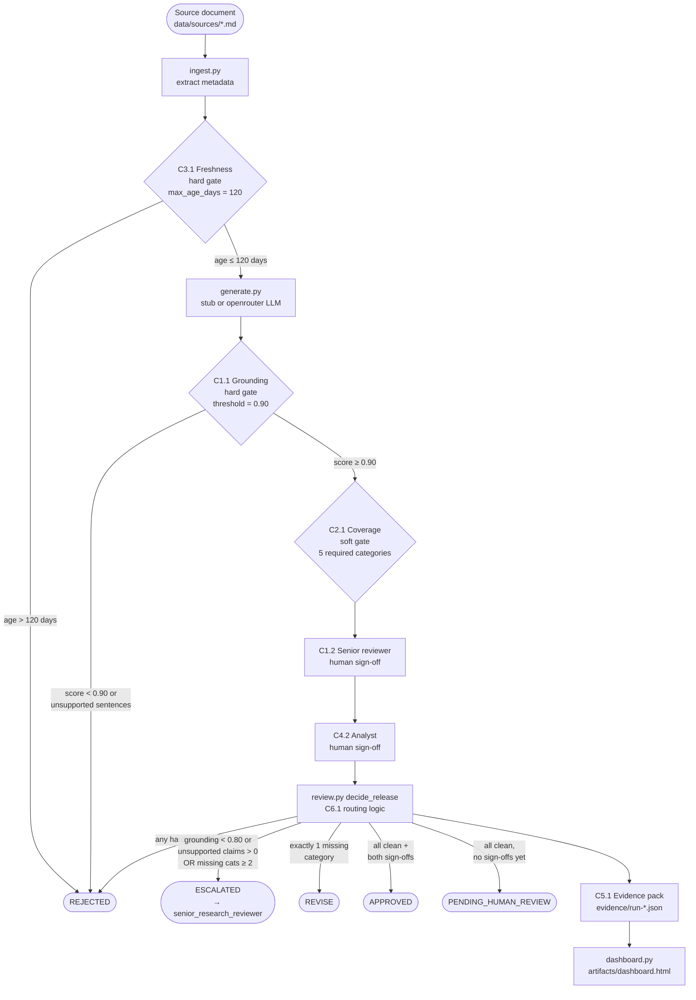

# NovaVest Research Summary Assistant v1

> **System definition:** NovaVest Research Summary Assistant v1 is a governed
> AI-assisted financial research summary workflow for internal analysts at
> NovaVest. It ingests public company disclosures (SEC filings, earnings
> transcripts), generates first-draft summaries via LLM, runs 7 mandatory
> controls, collects human sign-offs, and routes each run to one of four
> release outcomes before the output can be used beyond draft support.

Implementation of the frozen NovaVest spec — controls, sample cases, decision
logic, evidence packs, governance dashboard, and lab-based governance artifacts
(LoD1 / LoD2 / LoD3).

## Repository

> **GitHub:** https://github.com/Leon-ZXiang/AI-Design-and-Deployment-Risks---Final-Project-main

## Code architecture

### Module map

```
src/
├── config.py          load_control_matrix(), find_control()   — YAML loader, control lookup
├── ingest.py          load_source()                           — parse source doc + metadata
├── generate.py        generate_draft(), make_openrouter_judge()  — stub & live LLM generation
├── workflow.py        run()                                   — end-to-end pipeline orchestrator
├── review.py          decide_release()                        — C6.1 routing + release-gate logic
├── evidence.py        write_evidence_pack()                   — C5.1 JSON evidence writer
├── dashboard.py       build_dashboard()                       — HTML governance dashboard
└── controls/
    ├── grounding.py   check_grounding()                       — C1.1 token + semantic grounding
    ├── risk_coverage.py check_risk_coverage()                 — C2.1 keyword coverage check
    └── freshness.py   check_freshness()                       — C3.1 filing-date staleness gate
```

### Data flow

```
Source .md file
    │
    ▼ ingest.py
SourceDocument(text, filing_date, company, ticker, document_type)
    │
    ├─► controls/freshness.py  ──►  FreshnessResult   [C3.1 hard gate]
    │
    ▼ generate.py
GenerationResult(prompt, response, model)
    │
    ├─► controls/grounding.py  ──►  GroundingResult   [C1.1 hard gate]
    ├─► controls/risk_coverage.py ► CoverageResult    [C2.1 soft gate]
    ├─► (caller)               ──►  human C1.2 entry  [senior reviewer]
    ├─► (caller)               ──►  human C4.2 entry  [analyst sign-off]
    │
    ▼ review.py decide_release()
ReleaseDecision(final_status, hard_fails, soft_fails, escalation_reasons)
    │
    ▼ evidence.py write_evidence_pack()
evidence/run-YYYYMMDDTHHMMSSZ-XXXXXX.json              [C5.1 housekeeping]
    │
    ▼ dashboard.py (on demand)
artifacts/dashboard.html
```

### Configuration

All control parameters (thresholds, required categories, max age, escalation
triggers) live in `artifacts/control_matrix.yaml`. The code reads this file at
runtime — no hard-coded numbers in the source modules.

## Workflow diagram



## How to run

```bash
pip install -r requirements.txt          # pyyaml only — works offline with stub mode
python run_demo.py                       # runs 3 frozen cases, writes evidence/*.json
python -m src.dashboard                  # regenerates artifacts/dashboard.html
```

Open `artifacts/dashboard.html` in a browser to see the governance dashboard.

> `run_demo.py` defaults to `generation_mode="openrouter"`. To run fully
> offline without an API key, change line 104 in `run_demo.py` to
> `generation_mode="stub"`, or use the validation suite which always uses stub.

## Frozen sample cases

| Case | Source file | Expected status | Why |
| --- | --- | --- | --- |
| 1 — Microsoft | `data/sources/microsoft_10q_excerpt.md` | **APPROVED** | Grounded summary, filing within 120 days, all 5 risk categories covered, analyst `jsmith` + reviewer `kpatel` sign-offs provided |
| 2 — Apple | `data/sources/apple_10q_excerpt.md` | **REVISE** | Grounding passes, source fresh, but exactly 1 risk category missing (`regulatory`) — one correction needed before approval |
| 3 — Nvidia | `data/sources/nvidia_10q_excerpt.md` | **ESCALATED** | Source omits multiple material risk categories (litigation, liquidity, margin_pressure, forward_guidance, regulatory) — issue cannot be cleared in the normal review path |

Sources are synthetic excerpts created for this prototype. They imitate
public-disclosure structure but are not real SEC filings.

### Evidence files per case

Running `python run_demo.py` writes one JSON evidence pack per case to
`evidence/`. Example paths and contents:

```
evidence/
├── run-20260426T190327Z-a4a172.json    ← Case 1 Microsoft (APPROVED)
├── run-20260426T190427Z-f2dc8d.json    ← Case 2 Apple (REVISE)
└── run-20260426T190504Z-484d3e.json    ← Case 3 Nvidia (ESCALATED)
```

Each pack follows this schema:

```jsonc
{
  "run_id": "run-YYYYMMDDTHHMMSSZ-XXXXXX",
  "created_at": "ISO-8601 timestamp",
  "source_documents": [
    { "company": "...", "ticker": "...", "filing_date": "YYYY-MM-DD",
      "document_type": "10-Q", "path": "data/sources/..." }
  ],
  "prompt": "full system prompt + source text",
  "response": "[DRAFT — not approved for release]\n\n...",
  "control_results": [
    // C3.1
    { "control_id": "C3.1", "kind": "check", "source_date": "...",
      "source_age_days": 57, "max_age_days": 120, "freshness_pass": true, "passed": true },
    // C1.1
    { "control_id": "C1.1", "kind": "check", "grounding_score": 0.96,
      "unsupported_sentences": [], "total_sentences": 24, "passed": true },
    // C2.1
    { "control_id": "C2.1", "kind": "check", "coverage_map": {...},
      "missing_categories": [], "passed": true },
    // C1.2
    { "control_id": "C1.2", "kind": "human", "owner": "senior_reviewer",
      "signed_by": "kpatel", "status": "COMPLETED", "passed": true },
    // C4.2
    { "control_id": "C4.2", "kind": "human", "owner": "analyst",
      "signed_by": "jsmith", "status": "COMPLETED", "passed": true },
    // C6.1
    { "control_id": "C6.1", "kind": "routing", "escalated": false, "revise": false,
      "escalation_reasons": [], "revise_reasons": [], "escalation_target": null, "passed": true },
    // C5.1
    { "control_id": "C5.1", "kind": "housekeeping", "evidence_written": true,
      "note": "evidence pack written for run-...", "passed": true }
  ],
  "final_status": "APPROVED",
  "reviewer_id": "jsmith",
  "reviewer_decision": "APPROVED",
  "reviewer_notes": null,
  "escalation": null
}
```

## Exact implemented outcome logic

Decision logic is in `src/review.py` → `decide_release()`. Priority order:

| Priority | Outcome | Condition (exact code logic) |
| --- | --- | --- |
| 1 | **REJECTED** | Any `kind="check"` control with `gate="hard"` has `passed=False` — i.e., C3.1 (age > 120 days) or C1.1 (grounding_score < 0.90 **and** unsupported sentences present) |
| 2 | **ESCALATED** | C6.1 trigger fires: grounding_score < 0.80 OR unsupported_claim_count > 0; OR missing_categories ≥ 2 |
| 3 | **REVISE** | Exactly 1 missing required risk category (and no escalation trigger) |
| 4 | **APPROVED** | No hard fails, no escalation trigger, no missing categories, **both** analyst_signoff **and** senior_reviewer_signoff provided |
| 5 | **PENDING_HUMAN_REVIEW** | All automated checks pass but at least one sign-off is missing |

### Thresholds from `artifacts/control_matrix.yaml`

| Control | Parameter | Value | Effect |
| --- | --- | --- | --- |
| C1.1 | `pass_threshold` | 0.90 | Grounding score below this → hard gate fail → REJECTED |
| C1.1 | C6.1 `grounding_score_below` | 0.80 | Score in [0.80, 0.90) still fails C1.1 but triggers escalation trigger separately |
| C1.1 | C6.1 `unsupported_claim_count_above` | 0 | Any unsupported sentence fires the escalation trigger |
| C2.1 | `required_categories` | 5 (litigation, liquidity, margin_pressure, forward_guidance, regulatory) | Missing exactly 1 → REVISE; missing ≥ 2 → ESCALATED |
| C3.1 | `max_age_days` | 120 | Source older than 120 days → hard gate fail → REJECTED |

### Case trace

| Case | C3.1 | C1.1 score | Missing cats | Sign-offs | Final status |
| --- | --- | --- | --- | --- | --- |
| Microsoft | PASS (57 d) | ~0.96 PASS | 0 | jsmith + kpatel | **APPROVED** |
| Apple | PASS | PASS | 1 (regulatory) | none | **REVISE** |
| Nvidia | PASS | PASS | 5 (all) | none | **ESCALATED** |

## Implemented vs simulated

| Feature | Status | Notes |
| --- | --- | --- |
| C1.1 Source-grounding check | **Fully implemented** | Two-tier: token matching (always) + optional LLM-as-judge (openrouter mode only) |
| C2.1 Risk-factor coverage check | **Fully implemented** | Keyword lexicon for 5 required categories; missing-count drives REVISE/ESCALATE routing |
| C3.1 Source freshness validation | **Fully implemented** | Parses `filing_date` from source markdown, compares to today, hard-blocks if > 120 days |
| C5.1 Evidence-pack capture | **Fully implemented** | Every run writes a complete JSON pack to `evidence/`; dashboard reads these packs |
| C6.1 Escalation routing | **Fully implemented** | Threshold logic reads triggers from YAML; produces APPROVED / REVISE / ESCALATED / REJECTED / PENDING |
| Draft generation — stub | **Fully implemented** | Extractive summarizer, no API key needed, deterministic, used by test suite |
| Draft generation — openrouter | **Fully implemented** | Live LLM via OpenRouter; 5-retry exponential back-off on 429; requires API.txt |
| HTML governance dashboard | **Fully implemented** | Self-contained HTML; auto-refreshes from all evidence packs in `evidence/` |
| C1.2 Reviewer claim verification | **Simulated (parameter injection)** | Real deployment requires a UI; here reviewer identity is passed as a string argument |
| C4.2 Analyst sign-off | **Simulated (parameter injection)** | Same as C1.2 — no authentication or audit trail beyond the evidence JSON |
| Real-time monitoring | **Not implemented** | Dashboard is generated on demand; no continuous monitoring or alerting |
| LoD1/2/3 governance artifacts | **Static documents** | JSON and Markdown files authored to represent the three-line MRM governance process; not generated by code |

## Dashboard

`artifacts/dashboard.html` is generated by running `python -m src.dashboard`.
It is a self-contained single-file HTML page (no external dependencies) that
reads all evidence packs in `evidence/` and renders:

- Release outcome tiles (counts by APPROVED / REVISE / ESCALATED / REJECTED)
- Automated check pass rates (C1.1, C2.1, C3.1)
- Human sign-off tracking (C1.2, C4.2)
- Per-run table with grounding score, source age, missing categories, reviewer notes
- Links to LoD artifacts

> A static copy of the dashboard generated from the three sample cases is
> committed at `artifacts/dashboard.html`. Open it directly in a browser — no
> server required.

## Frozen control set

| Control | Name | Gate type | Owner | Module |
| --- | --- | --- | --- | --- |
| C1.1 | Source-grounding check          | Hard gate | system          | `src/controls/grounding.py` |
| C1.2 | Reviewer claim verification     | Hard gate | senior_reviewer | (human — injected as parameter) |
| C2.1 | Risk-factor coverage check      | Soft gate | system          | `src/controls/risk_coverage.py` |
| C3.1 | Source freshness validation     | Hard gate | system          | `src/controls/freshness.py` |
| C4.2 | Analyst sign-off before release | Hard gate | analyst         | (human — injected as parameter) |
| C5.1 | Evidence-pack capture           | Required  | system          | `src/evidence.py` |
| C6.1 | Escalation routing              | Soft gate | system          | `src/review.py` |

Note: C4.1 Draft labeling was part of an earlier draft spec. It is no longer a
separate control in the frozen 7-control set. The `DRAFT — not approved for
release` prefix is still applied to every generated draft as response-text
hygiene.

## Lab-based governance artifacts

Stored under `artifacts/lod/`:

| Lab artifact | File |
| --- | --- |
| LoD1 — Owner registration                  | `artifacts/lod/lab1_novavest_research_summary_assistant_v1.json` |
| LoD2 — MRM tiering decision (JSON)         | `artifacts/lod/384cca19-7811-426c-9254-430029e73c6f_risk_tiering.json` |
| LoD2 — Required controls checklist (JSON)  | `artifacts/lod/384cca19-7811-426c-9254-430029e73c6f_required_controls_checklist.json` |
| LoD2 — Executive summary (Markdown)        | `artifacts/lod/384cca19-7811-426c-9254-430029e73c6f_executive_summary.md` |
| LoD3 — Audit findings report (Markdown)    | `artifacts/lod/audit_findings_report.md` |
| LoD3 — Audit findings (JSON)               | `artifacts/lod/audit_findings.json` |

Three-line MRM story:

- **1L (owner)** — Proposed Tier 2, score 15 (decision_criticality 5 + data_sensitivity 2 + automation 3 + regulatory 5)
- **2L (MRM)** — Independent challenge uptiered to Tier 1, score 28 (decision_criticality 10 + data_sensitivity 5 + automation 4 + regulatory 9); requires 6 Tier 1 controls per Apex Financial MRM Tiering v2.1
- **3L (audit)** — Documentation complete, score 28 reproduced, tiering consistent; 5 of 6 Tier 1 controls still "In Progress"

## Team contributions

| Contributor | Role | Contributions |
| --- | --- | --- |
| Leon Xiang | Lead developer | System architecture, all Python source modules (`src/`), control implementations, evidence packing, dashboard, governance artifacts (LoD1/2/3), sample case design, test suite |

> This project was developed as part of ME575 AI Design and Deployment Risks
> at George Mason University. All code commits are attributed in the git
> history (`git log --oneline`).

## Validation

Two ways to assert the frozen outcomes — both use stub mode and require no API
key.

**Pure-Python:**

```bash
python -m tests.test_scenarios
```

Expected output:

```
PASS  Case 1 Microsoft -> APPROVED
PASS  Case 2 Apple     -> REVISE
PASS  Case 3 Nvidia    -> ESCALATED
PASS  smoke stale      -> REJECTED

4 passed, 0 failed
```

**Promptfoo (optional):**

```bash
npm install -g promptfoo
promptfoo eval -c tests/promptfooconfig.yaml
```

## Live LLM mode (OpenRouter)

The default `mode="stub"` uses a deterministic extractive draft so the control
pipeline works offline. To run real LLM drafts, install the optional dependency
and put an OpenRouter key + model in `API.txt` at the project root:

```bash
# API.txt format:
#   key: sk-or-v1-...
#   model: google/gemma-4-26b-a4b-it:free
python -c "from src.workflow import run; print(run('data/sources/microsoft_10q_excerpt.md', generation_mode='openrouter', analyst_signoff='jsmith', senior_reviewer_signoff='kpatel')['final_status'])"
```

`API.txt` is in `.gitignore` and must never be committed.

## Repo map

| Frozen-spec piece           | File(s) |
| --- | --- |
| System definition           | Top of this README + `src/dashboard.py` |
| Control matrix (frozen spec) | `artifacts/control_matrix.yaml` |
| Sample case sources         | `data/sources/*.md` |
| Sample case runner          | `run_demo.py` |
| Decision logic              | `src/review.py` |
| Grounding check (C1.1)      | `src/controls/grounding.py` |
| Coverage check (C2.1)       | `src/controls/risk_coverage.py` |
| Freshness check (C3.1)      | `src/controls/freshness.py` |
| Evidence packs (C5.1)       | `src/evidence.py`, `evidence/run-*.json` |
| Dashboard                   | `src/dashboard.py`, `artifacts/dashboard.html` |
| Lab artifacts (LoD1/2/3)    | `artifacts/lod/` |
| Validation suite            | `tests/test_scenarios.py`, `tests/promptfooconfig.yaml` |
